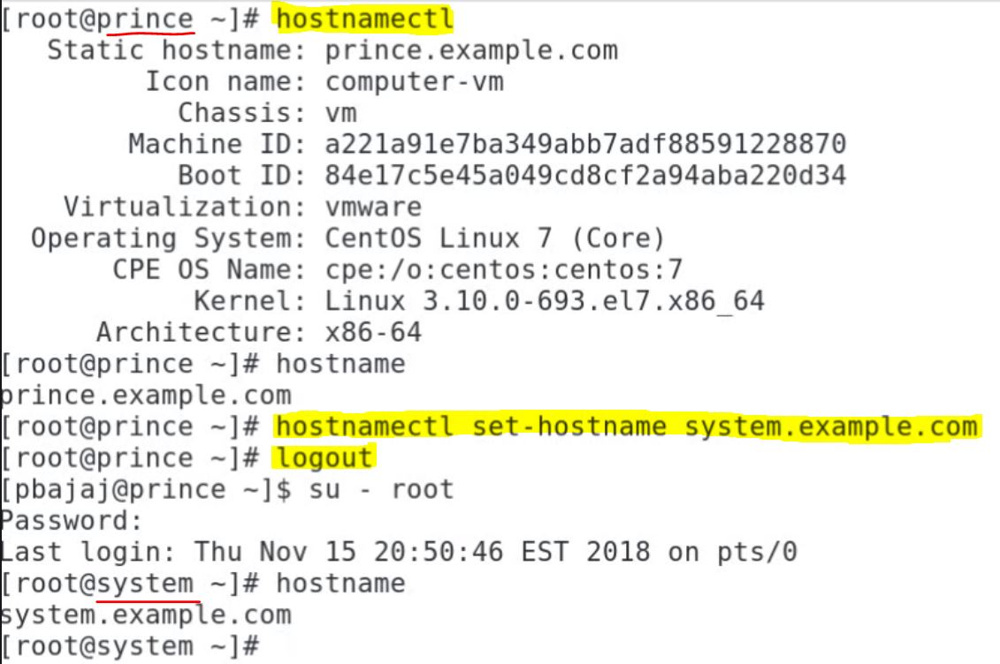

# Operate Running Systems & Processes

## Adjusting priority of Process w/ `renice`

---

> **Task 1. CPU intensive Process w/ name `dd` is running on system w/ NICE (NI) value of -5 & taking more CPU attention than default**:
>> - Adjust the niceness value to 5 so that CPU pays less attention to this process.

Commands:
- `top` - to check the nice (NI) value & priority (like task manager)
- `renice -n 5 -p <insert PID #>` - to adjust nice value (`-p` = process)

NICE value can be between -20 to 19. The lesser the (NI) value, the more CPU resources will be used. The higher the (NI) value, less CPU attention will be given. The higher value of priority (PR) means less priority.

- **NOTE** - never run process w/ (NI) value of -20, CPU will give highest prioirty & no other jobs will be able to run.

## To run job w/ a pre-defined (NI) value

---

> **Task 2. Run the below command in the background w/ (NI) value of 10**:
>> - `sleep 3600`

Commands:
- `nice -n 10 sleep 3600 &` - to start a process with a pre-defined (NI) value. `&` runs the task in the background.

## Killing a Process forcefully

---

> **Task 3. Kill the process `dd` to stop forcefully**:

Commands:
- `kill -9 <insert PID #>` - to kill the process `dd` forcefully. (`-15` would stop the task gracefully)

- another way - after typing `top` hit `k` and type in "PID #".

## Installing KVM using `virt-manager`

---

> **Task 4. Install RedHat / CentOS 7 on system as guest OS using KVM hypervisor (very unlikely this will be on exam)**:
>> - Virtual machine must be started at boot process.

Pre-requisites: (when using Linux as host operating system)
- host machine CPU must have 64-bit architecture
- virtualization must be enabled from BIOS setting of machine
- check `cat /proc/cpuinfo | grep vmx` (check for vmx component - for intel processors)

Commands:
- `yum groups install "Virtual Host"` or `yum install virt-manager qemu-kvm` - to install required packages.
- `systemctl status libvirtd` - to check the status of `libvirtd` (daemon - sits b/w virtualization layer & administrative layer to access kvm).
- `virt-manager` - (starts install of kvm) then follow the installation sequence.
- `virsh list --all` - to list all KVMs running on host machine.
- `virsh start <insert machine_name>` - to start the machine console.
- `virsh reboot <insert machine_name>` - to reboot the machine.

## Tuning Kernel Interface parameter `vm.swappiness` persistently

---

> **Task 5. Modify kernel parameter `vm.swappiness` to set the value to 10**:
>> - Changes done should persist after reboot.

- Definition: `vm.swappiness` - the default value of `vm.swappiness` is 60 & represents the percentage of the free memory before activating swap. The lower the value, the less swapping is used & the more memory pages are kept in physical memory.

- Changing the value directly influences the performance of the Linux system.
These values are defined:
* 0: swap is disabled
* 1: minimum amount of swapping w/o disabling it entirely
* 10: recommended value to improve performance when sufficient memory exists in a system
* 100: aggressive swapping

Commands:
- `sysctl -a | grep swappiness` - to display _all_ existing values of this variable.
- `sysctl -w vm.swappiness` - to change (_write_) the parameter _only_ during runtime (keep in mind after a reboot, changes done will be lost) - **dont' use this in the exam - everything will need to persist in the exam**
- for persistent change: `vi /etc/sysctl.conf` & add `vm.swappiness=10` at the bottom of file & `:wq` 
- after reboot, new value will be effective.

## Disable IPv4 IP Forwarding using `sysctl.conf`

---

> **Task 6. Modify kernel parameter to disable ipv4 packet forwarding**:
>> - Changes done should persist after reboot.

Definition:
IP forwarding allows an operating system (here on Linux) to forward packets as a router does or more generally to route them through other networks.

Commands:
- `sysctl -w net.ipv4.ip_forward=0` - to change the parameter in runtime, by default the parameter is set to `1` (meaning it is enabled). (**Keep in mind after reboot changes done will be lost**)
- for persistent change: `vi /etc/sysctl.conf` & `net.ipv4.ip_forward=0` & `:wq`
- after reboot, new value will be effective.

## Introduction - Managing tuned profiles

---

### Managing tuned profiles
- Tuned is a service which monitors the system & optimizes the performances of system for different use cases.
- There are pre-defined tuned profiles which are present under sub-directories on path `/usr/lib/tuned`.
- Tuned profiles are designed keeping in mind their parameters linked closely to performance of system:
    - High Throughput
    - Low Latency
    - Saving Power

#### Pre-defined profiles are divided into two categories:
- Power-saving profiles
- Performance-boosting profiles
    - You can customize a tuned profile based on standard profile or can create a completely new profile. Such profiles are always created under directory `/etc/tuned`. In case you want to create a new profile by adding different settings to a pre-defined profile, copy the profile from `/usr/lib/tuned` to `/etc/tuned` & add / modify different settings.
    - If two profiles have the same name under `/usr/lib/tuned` & `/etc/tuned`, the profile under `/etc/tuned` takes precedence.

## Tuned profiles & `tuned.conf`

---

#### Tuned profiles distributed w/ RHEL 8

- balanced (b/w powersave & performance)
- powersave
- throughput-performance (designed to give better, or best performance)
- latency-performance
- network-latency (based on latency performance)
- network-throughput (based on throughput performance)
- virtual-guest (based on throughput performance)
- virtual-host (based on throughput performance)

- **NOTE** - to learn about CPU governors - https://www.kernel.org/doc/Documentation/cpu-freq/governors.txt

`man tuned.conf` - man pages (tuned profile definition - consists of `main` & `include` & modify settings based on different plug-ins)

## Tuned main (Global) config file

---

> **Task 2. **:

Commands:
- `` - 
- `` - 
- `` - 
- `` - 

## Setting tuned profile

---

> **Task 2. **:

Commands:
- `` - 
- `` - 
- `` - 
- `` - 

## Customizing tuned profile

---

> **Task 2. **:

Commands:
- `` - 
- `` - 
- `` - 
- `` - 

## Merging tuned profiles

---

> **Task 2. **:

Commands:
- `` - 
- `` - 
- `` - 
- `` - 

