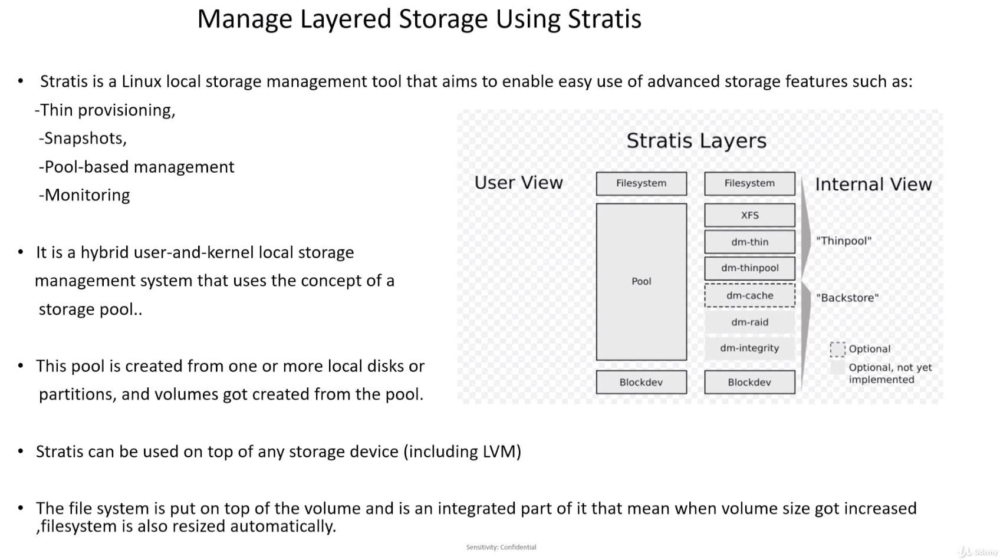

# Managing Layered Storage & Configuring Disk Compression

## Brief Intro - Managing Layered Storage using Stratis

---

- Stratis is a Linux local storage management tool that aims to enable easy use of advanced storage features such as:
    - thin provisioning
    - snapshots of File System
    - pool-based management
    - monitoring

- It is a hybrid user-&-kernel local storage management system that uses the concept of a storage pool. Only focused on the _User Layer_ for the exam.

- This pool is created from one or more local disks or partitions, & volumes got create from the pool. The only thing we need to take care of is the Storage pool; should not run out of storage, if it is, we must add more block devices to storage pool.

- Stratis can be used on top of any storage device (including LVM)

- The File System is put on top of the volume and is an integrated part of it; that means when volume size gets increased, the File System is also resized automatically.

## NEW

---

> **Task 2. **:

Commands:
- `` - 
- `` - 
- `` - 
- `` - 

## NEW

---

> **Task 2. **:

Commands:
- `` - 
- `` - 
- `` - 
- `` - 

## NEW

---

> **Task 2. **:

Commands:
- `` - 
- `` - 
- `` - 
- `` - 

## NEW

---

> **Task 2. **:

Commands:
- `` - 
- `` - 
- `` - 
- `` - 

## NEW

---

> **Task 2. **:

Commands:
- `` - 
- `` - 
- `` - 
- `` - 

## NEW

---

> **Task 2. **:

Commands:
- `` - 
- `` - 
- `` - 
- `` - 

## NEW

---

> **Task 2. **:

Commands:
- `` - 
- `` - 
- `` - 
- `` - 

**TODO**:
- [ ]  test
- [ ]  test