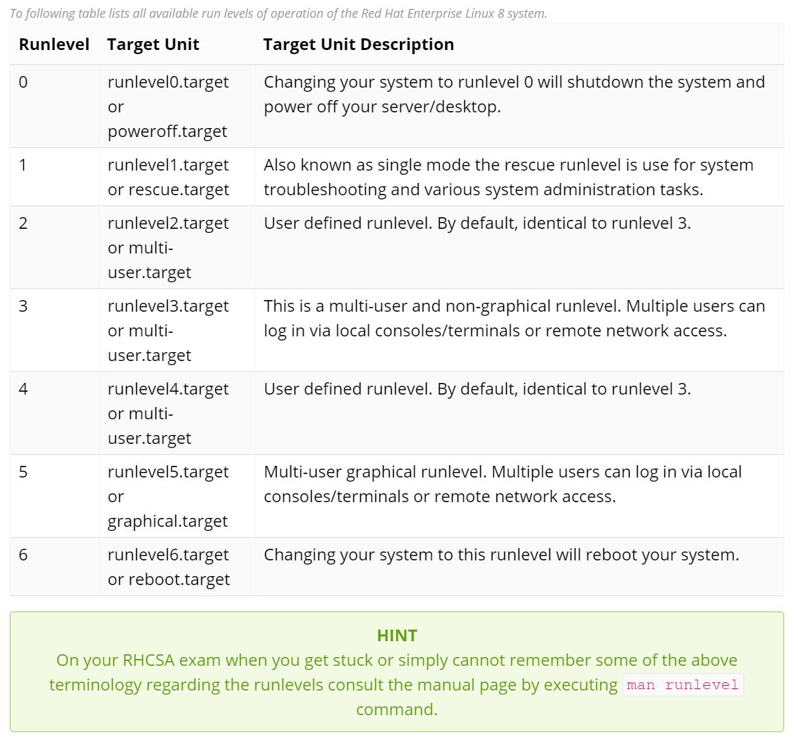
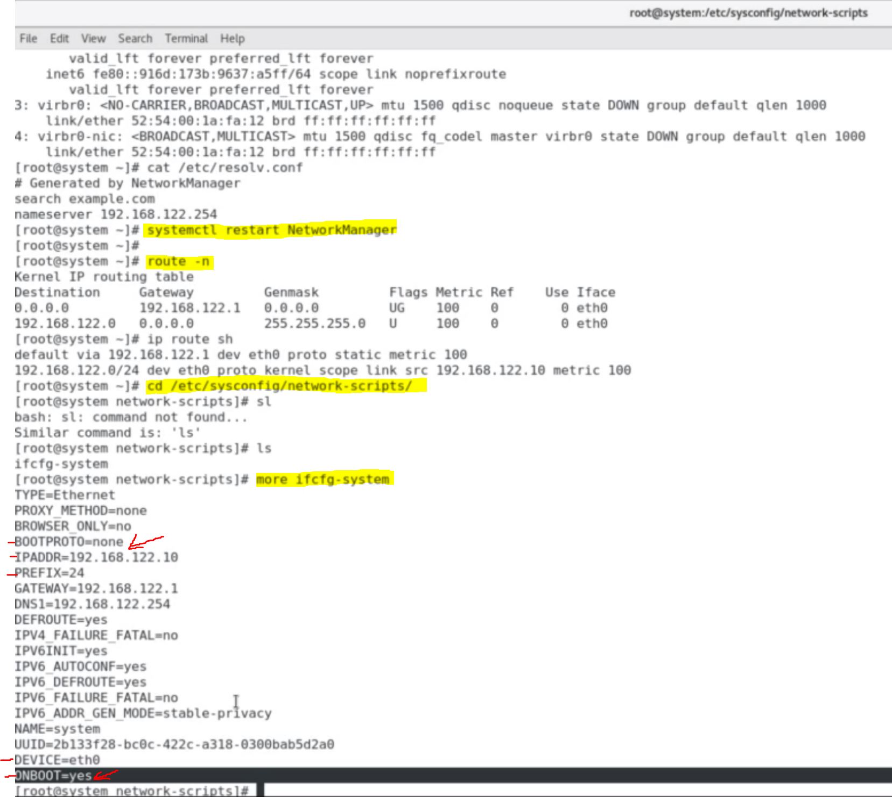
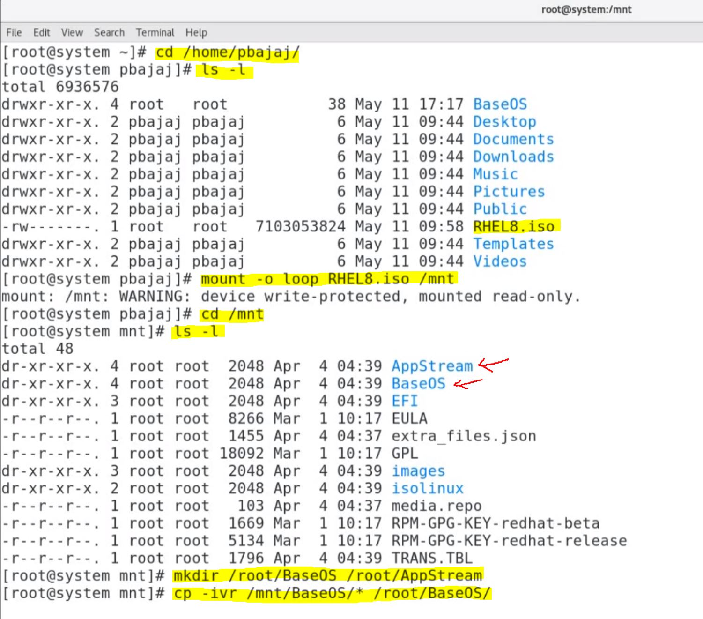
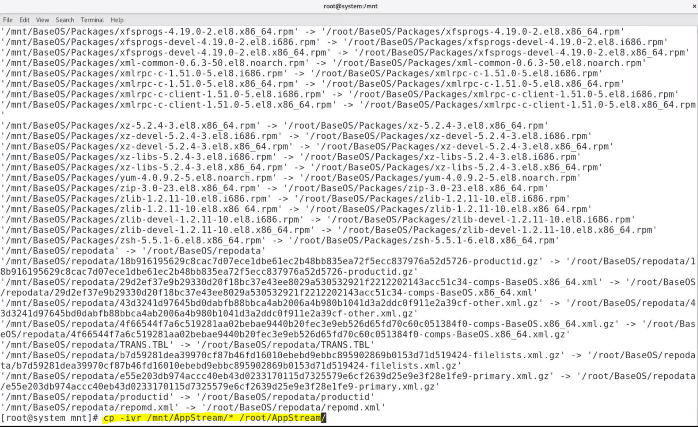
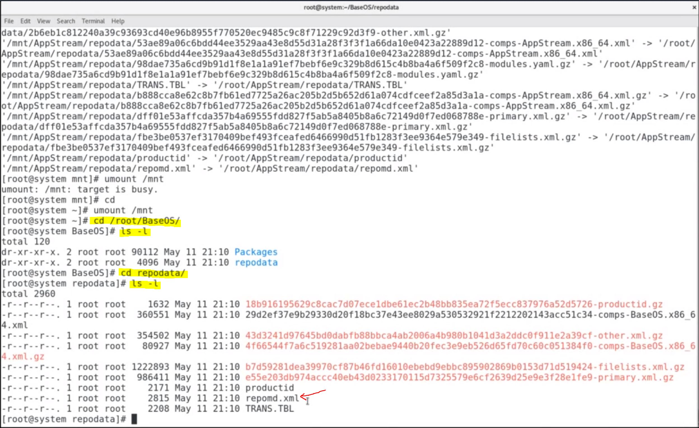

# Deploy, Configure, & Maintain Systems

## Configure system to boot in Graphical Target

---

> <span style="font-family:courier new">**Task 1. Execute command to change system to run in "Graphical" target. Make this setting persistent & system should boot in same target on next reboot**:</span>





Commands:
- `systemctl get-default` - to display the current SYSTEMD (Linux initialization system & service manager; provides logging daemon & other tools & utils for common admin tasks).
- `systemctl isolate graphical.target` - to change the SYSTEMD target in current session.
- `systemctl set-default graphical.target` - to set the SYSTEMD target which system will use by default.
- `cd /usr/lib/systemd/system` - directory containing SYSTEMD units of installed packages.
- `cd /etc/systemd/system` - directory containing local SYSTEMD configurations.
- `man runlevel` - *runlevels man page*.
- `man systemd.unit` - manual page for SYSTEMD units.

## Assign Host-Name to Machine

---

> <span style="font-family:courier new">**Task 2. Assign the host name `system.example.com` to your machine**:</span>

Commands:
- `hostnamectl` - to display the current hostname assigned to system.
- `hostnamectl set-hostname <insert hostname>` - to assign new hostname to machine [example: `hostnamectl set-hostname system.example.com`].
- `logout` - to logout and log back in to see the updated hostname.


## Configuring static IPv4 address on Interface (RHEL 8)

---

> <span style="font-family:courier new">**Task 3. Configure the IP 192.168.122.10 on eth0 interface on `system.example.com` & set the DNS IP as 192.168.122.254.**:
>> - Configure the Default Gateway as 192.168.122.1 (default gateway is used to route traffic to some other network when no other route specification matches the destination IP address of a packet.) 
>> - IP assigned must be static</span>

Commands:
- `nmcli connection show` - to display existing connections w/ interface names and status.
- `ip addr` or `ip a` - to display the existing interfaces w/ IP address assigned & status of interfaces.
- `systemctl status NetworkManager` - to check status of NetworkManager
- `nmcli connection add con-name system ifname eth0 type ethernet ipv4.addresses 192.168.122.10/24 ipv4.gateway 192.168.122.1 ipv4.dns 192.168.122.254 ipv4.method manual` - to add new static connection.
---
> - let's break that one down (video starts at 2:33): `nmcli` (interface used to config networking)
> - `connection add con-name <insert name>` (connection add; connection name)
> - `ifname eth0` (interface name - must be **eth0**)
> - `type ethernet ipv4.addresses <IP addr>` (to assign ipv4 address - Don't forget to specify subnet mask - default is **/32** & your machine will not communicate with any other machine on the network)
> - `ipv4.dns <insert DNS IP addr>` - no subnet mask is required here
> - `ipv4.gateway <insert default gateway IP>` - default gateway
> - `ipv4.method manual` - (_most important part_) - ipv4 method is set to manual to configure static connection - by default it will not be static if you forget this.
---
- `nmcli connection up <connection name>` - to activate the connection (w/ connection name; ex: "system").
- `systemctl restart NetworkManager` - to restart NetworkManager.
- `cd /etc/sysconfig/network-scripts` - to verify the connection settings.
- `cat /etc/resolv.conf` - to verify DNS IP address.
- `route -n` or `ip route show` - verify default gateway.





## Yum repositories BaseOS & AppStream in (RHEL 8)

---

> <span style="font-family:courier new">**On RHEL 8, we need to create (2) different repos for Directories BaseOS & AppStream present in RHEL 8 image file.**:
>> - BaseOS Repository - all base packages related to OS are provided through BaseOS repository.
>> - AppStream Repository - all packages related to user space are provided through AppStream Directory. 
>>    - user space packages are made independent of core kernel related packages in RHEL 8.
>>    - different versions of user space packages are made available in AppStream at the same time, depending on the requirement.
>>    - AppStream introduces a concept of modules.
>>    - in a module, multiple software versions can be offered for same package.
>>    - each software version is added as a different stream in module.
>>    - each module has a default Stream (if you don't specify a version - default version will be installed).
</span>

Commands (related to Modules):
- `yum module list` or `dnf module list` - list all available modules. (DNF = Dandified YUM; the next-generation version of the Yellowdog Updater, Modified, a package manager for .rpm-based distributions).
- `yum module info <module_name>` - displays info about modules including Streams, Packages.
- `yum module info --profile <php:7.2>` - shows info about specific Stream.


## Create local Yum repositiory & Yum groups from ISO-file (RHEL 8)

---

> <span style="font-family:courier new">**Task 4. Create local yum (dnf) repositories BaseOS & AppStream at location /root/BaseOS & /root/AppStream on system.**:
>> - Repo should be created with yum group information to use yum groups</span>





~~Commands~~ (**DISREGARD THIS BIT**):
- ~~`yum repolist` - to list the repositories configured for system~~
- ~~`yum groups list hidden` - to list yum group packages~~
- ~~`mount -o loop RHEL8.iso /mnt` - to mount image file on /mnt directory~~
- ~~`mkdir /root/BaseOS /root/AppStream` - to create the directories for repositories~~
- ~~`cp -iv /mnt/BaseOS/* /root/BaseOS` - copy everything from BaseOS directory /root/BaseOS (`--iv` = interactive verbose / overwrite; see if something is there - see more details by running `man cp`)~~
- ~~`cp -iv /mnt/AppStream/* /root/AppStream` - copy everything from AppStream directory /root/AppStream~~
- ~~`cd` & then `umount /mnt` - go back to home & unmount image file~~

> - ~~create the metadata for repositories with `createrepo_c` with `-g` option to include group information file in case it is needed (if metadata is already present, you will not need to execute this).~~
> - ~~`man createrepo_c` - manual page for createrepo_c~~
>    - ~~**Note** - `createrepo_c` is not available by default; you need to install the package before you can use it: `yum install createrepo_c`~~



---
#### using the pre-configured practice env - 

- On `server1` I navigated to the `yum.repos.d` by running `cd /etc/yum.repos.d`
- created a repo file `touch rpm.repo` named `rpm.repo` (can name whatever as long as it has `.repo` extension

then `vi rpm.repo` & added:

```
[BaseOS]
name=BaseOS
baseurl=http://repo.eight.example.com/BaseOS
gpgcheck=0
enabled=1

[AppStream]
name=AppStream|
baseurl=http://repo.eight.example.com/AppStream
gpgcheck=0
enabled=1
```

which follows this format -
```
[repo id]
description (name)
baseurl
gpgcheck
enabled
```
- then ran `dnf clean all` or `yum clean all` to clear cache
- then ran `dnf repolist` or `yum repolist` to list the repos configured for the system
- then run `yum groups list` or `dnf groups list` to list yum group packages

I then ran `dnf install nginx` to test installing packages & worked - can also run `dnf remove <package-name>` to remove.

## Configure System to use BaseOS & AppStream Repositories (RHEL 8)

---

> <span style="font-family:courier new">**Task 5. Configure the system to use BaseOS & AppStream repositories present at `/root/BaseOS` and `/root/AppStream`**:</span>

Commands:


## Scheduling job using crontab for other user as root user

---

Commands:

## Scheduling cron jobs as user other than root

---

Commands:

## Scheduling jobs using at command

---

Commands:

## Configure Service to start System boot

---

Commands:

## Working with package Module streams (RHEL 8)

---

Commands:

## Modifying Bootloader (GRUB2) settings

---

Commands:


**TODO**:
- [ ] for practice-env question: Thank you for creating this practice env; it saves a lot of time and learned a bit about Ansible & Vagrant in implementing the set up. Will `systemctl isolate graphical.target` or `systemctl set-default graphical.target` not work on the environments b/c the initial creation was not "server w/ GUI"? 
- [ ] for the exam - will you need to create a local repo via mounting the ISO or using remote baseurl?
