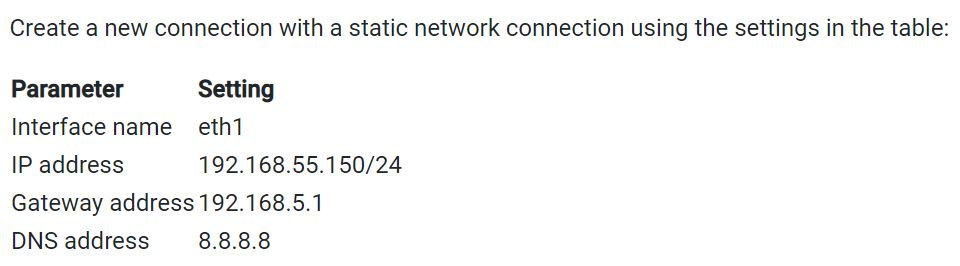
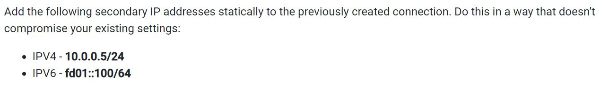

# [RHCSA 8 Practice Exam](https://rhcsapracticequestions.com/questions/questions)

This practice exam is for those that have gone through an RHCSA course/book and want to test their knowledge before sitting the RHCSA 8 exam .

# 

1.) Add 3 users: harry, natasha, tom. The requirements: The additional group of the two users: harry, natasha is the admin group. The user: tom's login shell should be non-interactive.

- `useradd -G admin harry`
- `useradd -G admin natasha`
- `useradd -s /sbin/nologin tom`
- `id harry;id natasha` - to show addt'l group
- `cat /etc/passwd` - to show the login shell

# 

2.) Plan to run echo hello command at 14:23 every day.

- `crontab -e`
- `23 14 * * * /bin/echo hello`
- `crontab -l` - to verify

# 

3.) Find the files owned by harry, and copy it to catalog: /opt/dir

- `cd /opt/`
- `mkdir dir`
- `find / -user harry -exec cp -rfp {} /opt/dir/ \;` - [(`-r` - recursive `-f` - force `-p` - preserve)](http://linuxcommand.org/lc3_man_pages/cp1.html)

# 

4.) Create a 2G swap partition which takes effect automatically at boot-start, and it should not affect the original swap partition.

- `fdisk /dev/sdb`
- `n` - `"Enter"` - `+2G` - `t` `82` - `:wq`
- `partprobe`
- `mkswap /dev/sdb6`
- `vi /etc/fstab` - **no mount point - no file system for swap**
> `/dev/sdb6` `swap` `swap` `defaults  0 0` (make entry in `fstab` file)
- `swapon -a` - to enable / activate SWAP as per entry in `fstab` file (**no mount needed**)
- `free -m` - to verify added SWAP

# 

5.) Create a user named alex, and the user id should be 1234, and the password should be alex111.

- `useradd -u 1234 alex`
- `passwd alex` - `alex111`

# 

6.) Securely copy /root/shared files from your machine to “server2.example.com” to /shared directory, ssh connection is not established, use the password "password"

- `scp /root/shared server2.example.com:/shared/` & enter password

# 

7.) Find all the files owned by user “alex” and redirect the output to /home/alex/files

- `find / -user alex -type f > /home/alex/files`

# 

8.) Configure the IP 192.168.122.10 on eth0 interface on ‘system.eight.example.com’ and set the DNS IP as 192.168.122.254. Configure the Default Gateway as 192.168.122.1. The IP assigned must be static.

- `systemctl status NetworkManager`
- `nmcli connection show`
- `ip a`
- `nmcli connection add con-name system type ethernet ifname eth0 ipv4.address 192.168.122.10/24 ipv4.gateway 192.168.122.1 ipv4.dns 192.168.122.254 ipv4.method manual` (**is "system" the name of the server, or is it always "system"???**) 
- `nmcli connection up system`
- `systemctl restart NetworkManager`
- `cd /etc/sysconfig/network-scripts` - verify connection settings
- `cat /etc/resolv.conf` - verify DNS IP address
- `route -n` - verify default gateway

# 

9.) Copy all the lines starting with "ted" "Ted" from ted.txt and copy it to file onlyted.txt

- `cat ted.txt | grep -i ^ted > /onlyted.txt`
- `cat onlyted.txt` - verify

# 

10.) Schedule a script /myawesomescript.sh as user “nick” which should be executed 12:15 every Tuesday.

Make sure that only nick can schedule cron jobs as a non-root user

- `vi /etc/cron.allow` & add `nick` to file
- `su - nick` - switch to nick
- `crontab -e`
- `15 12 * * 2 /myawesomescript.sh`
- `crontab -l` - to view job

# 

11.) Schedule a script /myawesomescript.sh as user “ sam ” which should be executed every 15 minutes

- `crontab -u sam -e` - as root
- `*/15 * * * * /myawesomescript.sh`
- `crontab -u sam -l`

# 

12.) Change the default password policy so that newly created users have passwords that must be changed every 60 days

- `vi /etc/login.defs` & change `PASS_MAX_DAYS 60` 

# 

13.) Add group called testers with GID 30000

- `groupadd -g 30000 testers`

# 

14.) Create users tester1, tester2, tester3 with testers as their supplementary group

- `useradd -G testers tester1`
- `useradd -G testers tester2`
- `useradd -G testers tester3`

# 

15.) Force all the testers to change their password whenever they log on to the system for the first time

- `chage -d 0 tester1`
- `chage -d 0 tester2`
- `chage -d 0 tester3`

# 

16.) Configure administrative rights for all the members of the testers group (**REVIEW**)

- `vi /etc/sudoers.d/testers` - new file called `/etc/sudoers.d/testers`
- `%testers ALL=(ALL) ALL` - add the entry
- `cat /etc/sudoers.d/testers` - view file contents

# 

17.) Set the users account for tester1, tester2, tester3 to expire in 30 days (**REVIEW**)

- `date -d "+30 days" +%F` - use `date` to get the time after 30 days

    - use the time to set the account expiry:
- `chage -E 2020-06-03 tester1` 
- `chage -E 2020-06-03 tester2`
- `chage -E 2020-06-03 tester3`

# 

18.) Change the password policy for tester3 to require a new password every 10 days

- `chage -M 10 tester3` 

Important to know these [differences](https://www.cyberciti.biz/faq/understanding-etcshadow-file/), some questions ask about the **account expiring**, and some of the questions ask about **requiring a new password**

Also, this command is what you use for an individual user, if the question asks about the default maximum age for all the users, the you need to change the file: `/etc/login.defs`

# 

19.) Create a volume group called "shazam" consisting of two physical volumes each 256MB in size

- `fdisk /dev/sdb`
>`n` - `e` - "Enter" - "Enter" - `n` - "Enter" - `+256M` - "Enter" - `t` - "Enter" - `8e` (change partition to "LVM")

- do the same thing again to create the second partition.

- `partprobe`

- `pvcreate /dev/sdb8 /dev/sdb9`

- `vgcreate shazam /dev/sdb8 /dev/sdb9`

- `vgdisplay`

# 

20.) Add a logical volume called storage in the volume group shazam mounted at /storage permanently as xfs

- `lvcreate -n storage -L 400M shazam`
- `lvdisplay`
- `mkfs -t xfs /dev/shazam/storage`
- `mkdir /storage`
- `vi /etc/fstab`
> `/dev/shazam/storage  /storage  xfs  defaults  1  2`
- `mount -a`

# 

21.) Extend the logical volume storage to be 700MB

- `fdisk /dev/sdb`
- `n` - "Enter" - "Enter" - `+512M` - `t` - "Enter" - `8e` - `wq`
- `partprobe`
- `lsblk` - check new partitions
- `vgextend shazam /dev/sdb10`
- `vgdisplay`
- `lvextend -r -L 700M /dev/shazam/storage`
- `df -h` - verify changes

# 

22.) 

- `systemctl status NetworkManager`
- `nmcli connection show`
- `ip a`
- `nmcli connection add con-name system ifname eth1 type ethernet ipv4.addresses 192.168.55.150/24 ipv4.gateway 192.168.5.1 ipv4.dns 8.8.8.8 ipv4.method manual`
- `nmcli connection up system`
- `systemctl restart NetworkManager`
- `cd /etc/sysconfig/network-scripts` - verify connection settings
- `cat /etc/resolv.conf` - verify DNS IP address
- `route -n` - to verify default gateway

# 

23.) Configure the previously created connection to be auto started

- `nmcli con mod system connection.autoconnect yes` - configure the `connection.autoconnect` to "yes" for the connection
- `nmcli con mod other-connection connection.autoconnect no` - configure the `connection.autoconnect` to "no" for the rest of the connections.

# 

24.) 

- `systemctl status NetworkManager`
- `nmcli connection show`
- `ip a`
- `nmcli connection modify con-name system +ipv4.addresses 10.0.0.5/24 +ipv6.addresses fd01::100/64 ipv4.method manual ipv6.method manual`
- `nmcli connection up system`
- `systemctl restart NetworkManager`
- `cd /etc/sysconfig/network-scripts` - verify connection settings

# 

25.) Configure the hosts file so that 10.0.0.5 could be referenced as private (**REVIEW THIS**)

- `echo -e "10.0.0.5 private" >> /etc/hosts` - as root (basically editing `/etc/hosts` file

# 

26.) Configure httpd to use port 1001 (**REVIEW THIS**)

- `yum provides semanage` - in case `semanage` is not installed by default (should be installed on exam env)
- `yum install policycoreutils-python-utils -y`
- `semanage port -a -t http_port_t -p tcp 1001` - add port 1001 as an http port; add the port as `http_port_t` ( `-a` add `-t` type `-p` protocol)

- now that we added port 1001 as an HTTP port, SELinux should be content

- the second part of the problem is mostly going to be the firewall that doesn't allow port 1001

- `firewall-cmd --get-default-zone` - we need to add that port, but before that, we need to make sure that we are in the public zone - adding port to the firewall public zone - `firewall-cmd --set-default-zone public`

- `firewall-cmd --permanent --zone=public --add-port=1001/tcp` - success & done!

# 

27.) Allow your web server httpd to access files at /var/web-content, Configure your SELinux to allow that. (**REVIEW THIS**)

- `ls -dZ /var/www/html` - by default Apache can access the `/var/www/html` folder b/c the context is `httpd_sys_content_t` - check the correct context
- `mkdir -p /var/web-content` - create a new folder (it might be already created in the exam) 
- `semanage fcontext -a -t httpd_sys_content_t "/var/web-content(/.*)?"` - Create a file context rule that will set the default type to `httpd_sys_content_t` for `/var/web-content` and all the files below it - (Notice the regular expression at the end which means the directory and all the files)
- `restorecon -Rv /var/web-content` - use `restorecon` to the set the SELinux context for the files in `/var/web-content`

 ######  * These two questions should be enough to handle security questions and firewall questions

 ######  * Just remember to know how to change the context as notated in these questions, add a port to SELinux, add a port for the firewall

# 

28.) Establish ssh connection with server 2 at 192.168.55.151 for the user vagrant

- `ssh-keygen`
- `ssh-copy-id vagrant@192.168.55.151` & type `yes` when prompted with "Are you sure you want to continue connecting?"

# 

29.) Add 512MB swap partition

- `lsblk` 
- `fdisk /dev/sdb` - add a partition `n` - `e` - "Enter" - "Enter" - `+512M` - `t` - "Enter" - `82` (Linux swap / Solaris) - `wq`
- `partprobe`
- `mkswap /dev/sdb3` - format the partition as swap space
- `vi /etc/fstab`
> /dev/sdb3 swap swap defaults 0 0
- `swapon -a` - enable the newly created swap
- `swapon -s` - verify your changes

# 

30.) Configure the chronyd service on server1 to synchronize the system time with the NTP time source at repo.eight.example.com

- `timedatectl set-ntp yes` - turn on time sync
- `vi /etc/chrony.conf` - & add the following:
> `server repo.eight.example.com iburst`
- `timedatectl` - verify that the sync is enabled
- `chronyc sources` - verify that system is sync'd w/ repo.eight.example.com

# 

31.) The server is re-located to Bahamas, configure the timezone appropriately.

- `tzselect` - get the timezone
- `timedatectl set-timezone America/Nassau` - use the timezone you get to set the timezone of the server
- `timedatectl` - verify changes

# 

32.) Create a thinly provisioned filesystem called "practice-fs" using stratis in a pool named "practice-pool" mounted at /practice-stratis-volume

- `yum install stratisd stratis-cli` - download required packages
- `systemctl status stratisd` - check status
- `systemctl enable stratisd` - must enable prior to creating pools or it won't work
- `stratis pool create practice-pool /dev/sdc` - create pool w/ specified disk(s)
    - **note**: to _extend_ the size of stratis storage pool / adding more partition(s) you could:
    `stratis pool add-data <pool_name_firstpool> <device_/dev/sdc7>` 
- `stratis pool list` - verify pool is created
- `stratis filesystem create practice-pool practice-fs` - create the File System
- `stratis filesystem list` - verify filesystem is created
- `mkdir /practice-stratis-volume` - create mounting point
- `lsblk --output=UUID /stratis/practice-pool/practice-fs >> /etc/fstab` - append UUID to `fstab` file
- `vi /etc/fstab` : instead of UUID you could use device name format - `/stratis/practice-pool/practice-fs`
> `UUID=blahblahblah   /practice-stratis-volume   xfs  defaults,x-systemd.requires=stratisd.service  0 0`
- `mount -a` - mount the FileSystem
- `df -h` - verify

######  * (**IMPORTANT**) don't forget to add the options appropriately `x-systemd.requires=stratisd.service` is needed for stratis filesystems

# 

33.) Create vdo volume practice-vdo with the device /dev/vdd, set the logical size to 50 GB (**this will not persist a reboot... right? so should mount even if not asked?**)

- `yum install vdo kmod-kvdo` - install VDO (two packages)
- `vdo create --name=practice-vdo --vdoLogicalSize=50G --device=/dev/vdd` - create the vdo
- `vdo list` - verify the vdo has been created
# 

34.) Mount the newly created vdo on /vdo-practice with XFS filesystem so that it persists across reboots.

- `mkfs -t xfs -K /dev/mapper/practice-vdo` - create the FileSystem
- `udevadm settle` - to register the new device node (try w/o this first time)
- `mkdir /vdo-practice` - create the directory
- `lsblk --output=UUID /dev/mapper/practice-vdo >> /etc/fstab`
> `UUID=blahblahblah   /vdo-practice  xfs  defaults,x-systemd.requires=vdo.service  0 0`
- `mount -a` mount the volume

# 

35.) Use tar command to archive all contents of /etc directory in /root/etc.tar file. Compress the archived files using gzip

- `tar -czvf /root/etc.tar.gz /etc`

# 

36.) Create symbolic link for /home/vagrant/test that will be named /tmp/test-link

- `touch /home/vagrant/test` - create test file
- `ln -s /home/vagrant/test /tmp/test-link`

# 

37.) Create hard link for /home/vagrant/test that will be named /tmp/test-hard

- `ln /home/vagrant/test /tmp/test-hard`

# 

