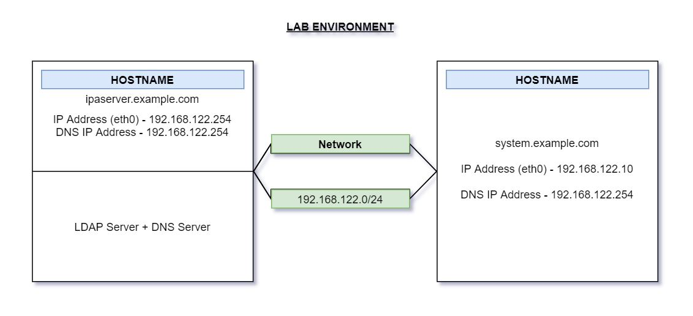

## Lab Chapter will include:
install & configure LDAP and integrated DNS server w/ 3 IPA server solution

In the exam you will already have this machine pre-configured:

__________

I am following along Prince Bajaj's very helpful [Udemy Course](https://www.udemy.com/course/rhcsa-practice-exam-questions-ex200-redhat-release-7/) to create this study guide.

## Differences b/w RHEL 8 & RHEL 7 from RHCSA exam point of view:
> 1.) **Repository** - RHEL 8 is distributed through (2) main repos - make sure you define two repos on RHEL 8:
- Base OS
- AppStream

The concept of _modules_ is introduced - modules are collections of packages representing a logical unit: an app, language stack, DB, or a set of tools.

> 2.) **Changes in YUM stack** - on RHEL 8, installing software is ensured by the new version of the YUM tool, which is based on DNF technology (YUM v4).

Advantages of YUM v4 over YUM v3:
- increased performance
- support for modular content

> 3.) **Time Synchronization** - in RHEL 8, the NTP protocol is implemented only by the _chronyd_ daemon, provided by the _chrony_ package.

- Conversely, RHEL 7 supported (2) implementations of the NTP protocol: _ntp_ & _chrony_
- The _ntp_ daemon is no longer available - if you used ntp on RHEL 7, you might need to migrate to _chrony_

> 4.) **Networking** - default tool for network management is _NetworkManager_. 

- In RHEL 8, to run the `ifup` & `ifdown` scripts, _NetworkManager_ must be running.
- The basic installation provides a new version of the `ifup` & `ifdown` scripts which call _NetworkManager_ theough the `nmcli` tool.
- _Network scripts_ are deprecated in RHEL 8 & are no longer provided by default.

> 5.) **Storage** - (most important difference) _Stratis_ is now available in RHEL 8

- _Stratis_ is a new local storage manager. It provides managed file systems on top of pools of storage w/ addt'l features to the user.

- (VDO) - virtual disk / data optimizer

> 6.) **System Authentication** - `authselect` replaces `authconfig` (can't use at all) tool used for system authentication (LDAP Authentication in this course).

- You will not be able to use `authconfig-tui` in RHEL 8 to configure LDAP Authentication

- You can join IPA domain on `ipaserver.example.com` by executing below commands on your system & can use LDAP users created on `ipaserver.example.com` host.

- `yum install ipa-client` - to install ipa-client package

- `ipa-client-install` - to join IPA domain on FREEIPA Server

###### * There are other differences (security & virtualization) b/w RHEL 7 & 8 but are not covered in the RHCSA exam.

**TODO**:
- [x] ~~Build VM~~
- [ ] verify build that will be administered on exam
- [ ] verify materials that can be used for help
- [ ] look up how patches / updates are done on RHEL 8 (licensing involved?)

