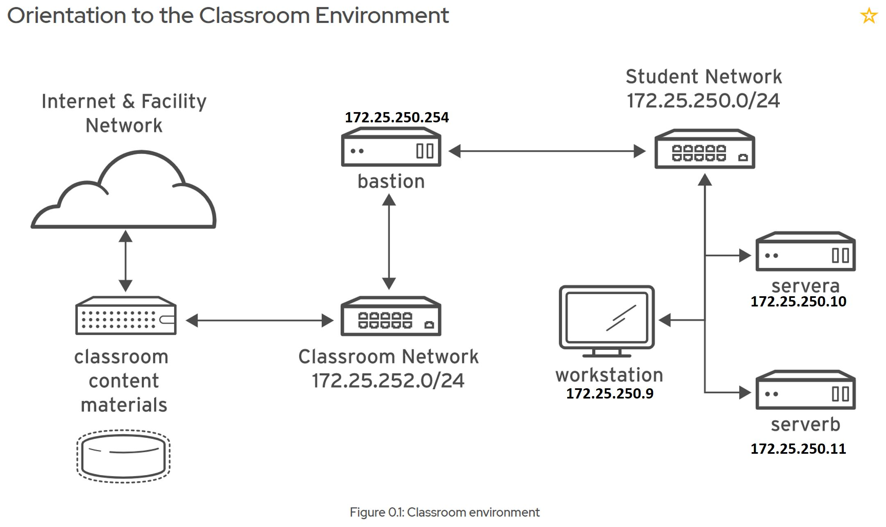
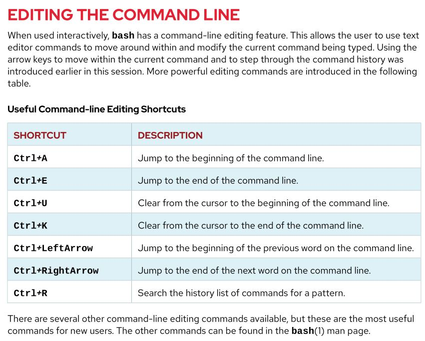

# Chapter 1

## Classroom Environment

---

If there is a security issues / bug... etc. with open source software, the power is with whoever is technically capable.

RHEL 8 looks towards fedora to formulate RHEL - supported by Red Hat and throughly tested.

- `ls -l /boot` (long listing against a directory called "boot") vs `ls -all /boot` (as a result of a single dash - interept all letters as a single letter: "a" "l" & a redundant use of "l") vs `ls --all /boot` (with a double dash - we are going to interept the entire word as a single word)

- CTRL + "D" (shortcut to logout)

- fingerprint is located - `vi .ssh/known_hosts` 

- **unconditional** commands `;` (execute all commands regardless of successful completion) vs **conditional** commands `&&` (execute _only_ if the previous command executed successfully)
    - also **conditional** `||` the cmd to the left of the double pipe, _only_ then are we going to execute the command to the right.

- `file` command - looks at contents of file and tells us what type of file it is.
    - `file /etc/issue` - useful in determining type of file we are dealing with

- displaying contents of a file - `cat /etc/fstab` - `tac` is the opposite and shows the bottom of a file. `head` - will show first 10 lines, similiarly `tail -40 /etc/services` will show you the last 40 lines

- `wc -l /etc/services` ( `wc` = word count - `-l` counts the lines in a file)

- double tab to see options `useradd --` "Tab" + "Tab"

- argument history - "Alt" + "." - similiar to up arrow

- `authconfig \` - don't have to type in the `\` every option is on a different line.

- `history` - shows pervious commands - can recall / re-execute with `!` (ex: `!13` `!!` recalls the last one). CTRL + "R" recalls a particular cmd & then "Tab" 

- everything starts at the `root` `home` is found at the `/` of the File System

- `bin` (contains executables or binaries used by all users) & `sbin` (system binaries - used only by root user)

- `usr` stands for "unix system resources"

- `dev` contains device files

- `etc` extended text configuration files (where do I configure ssh...etc.)

- `run` directory contains runtime data - recreated on re-boot - `var` data survives reboot (log files, database data)

- `/tmp` - files that aren't access within 10 days will be purged

---

- Absolute paths (full path - will always begin with a "/") & Relative paths (relative to parent position - will never begin with a leading "/")
    - `mkdir ./foo` (current directory) vs `mkdir .foo` (hidden file)

- `cp -r /user/share/doc/unzip .` - copy recursively to current directory

- Files are identified by Index Node (inode) - keeps track of permissions, ownerships, Date & Time stamps & paths to data on FS (except for file name)
    - `ln file1 file2` - same file (same inode) - `ls -li` to view inode
    - `ln -s file3 file4` - soft / symbolic link (different inode) - the last argument is the thing that we want to create

- `ls ?file` - match to any character following "file"

- `ls [ace]*` - match any of these characters & don't care what comes afterwards
    - `ls [!ace]*` - the opposite (not)

- `echo {Sun,Mon,Tues,Wednes}day.log` - really quick way to create multiple files - brace expansion - can combine various braces.

- create variables with caps - {FIRST_NAME}=Noreen - to return `echo ${FIRST_NAME}` - can use absolute values with curly braces (boundaries) - good common practice to use curly braces around vars.

