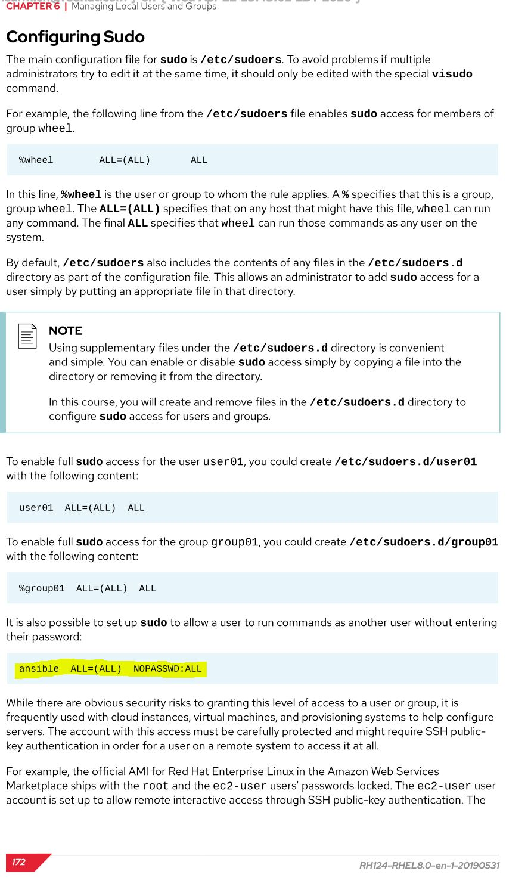
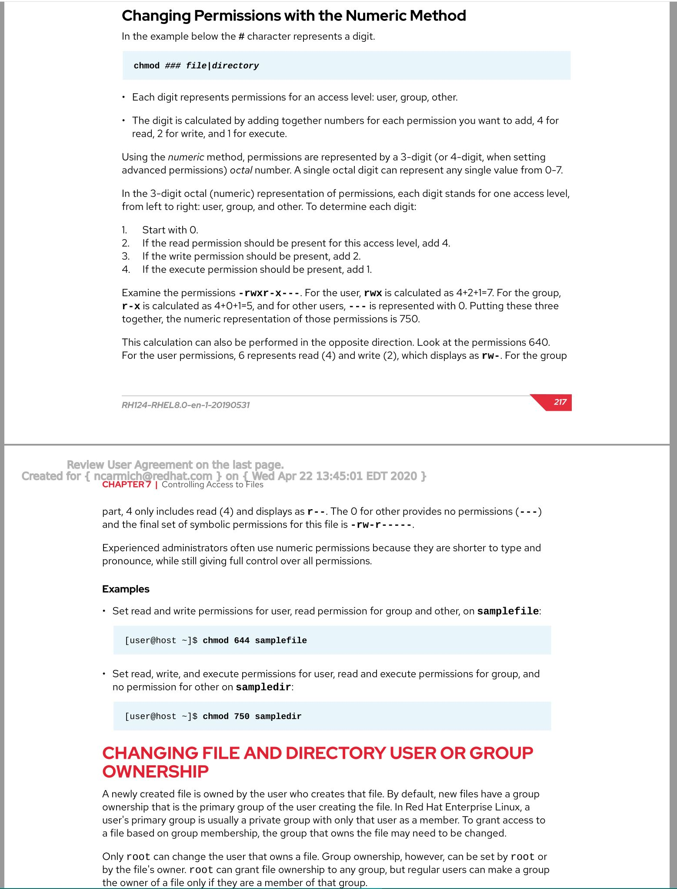
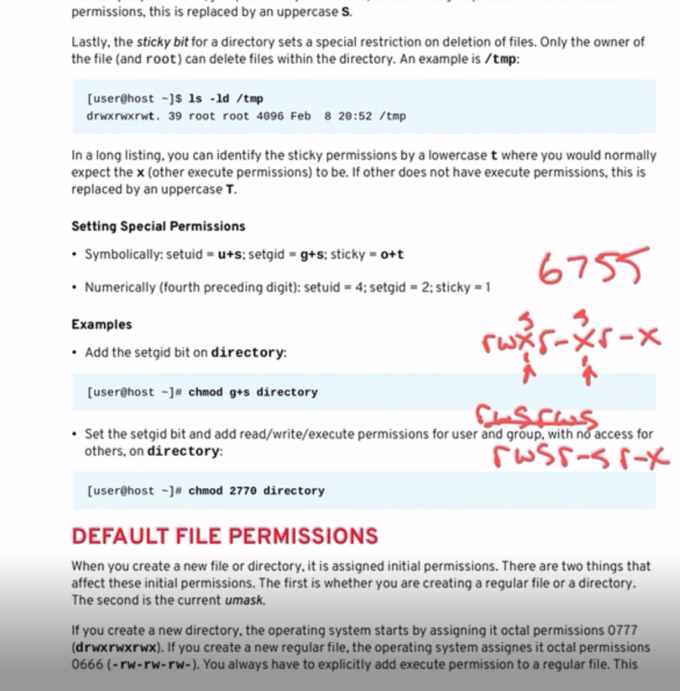

# Chapter 1

## Accessing Systems & Obtaining Support

---

- `redhat-support-tool`

### Managing Local Users & Groups | Describing User & Group Concepts

---

- The only difference b/w your Primary Group (can only be one) & Supplementary Groups (can have many)
    - This is the group listed by GID number in the `/etc/passwd` file & by default this is the group that will own new files created by the user.

- using `su - <username>` is the switch user cmd
    - using `su -` will switch to `root` identity & its env.
    - using `su` (w/o dash) will keep your same env. but switch to `root` in that shell / env

- configuring no password for service accounts:


## Controlling Access to Files

---

### Managing File System Permissions from the Command Line


- `chmod` = change mode (remember `-R` option to recursively set permissions) - `chmod ### file|directory`

- `chown` = change owner (remember `-R` option to recursively set permissions) - `chown owner:group file|directory`

---
```
- (4) - (2) - (1)
- (r) - (w) - (x)
```
---
- `ls -ld` - view parameters on the directory itself; make sure to specify which directory... `ls -ld /home/consultants`
- `ls -lh` - make disk sizes human readable
- `ls -al` - show all files, even hidden (probably best option here)

### Managing Default Permissions & File Access

- `u+s` (suid) (**4**) --- `g+s` (sgid) (**2**) --- `o+t` (sticky) (**1**) - (ex: `chmod 2770 /home/techdocs`)



- `umask` - mask away bits - never want to set, either r-w-x settings on a certain dir

# Chapter 2

## Managing SELinux Security

---

### Changing the SELinux Enforcement Mode

- SELinux by default is a deny everything policy

- `chcon` (change con) - sets context on files (doesn't use a DB & will not survive a relabel) --- `restorecon` - set default contexts

- pirate syntax `(/.*)?`

- creating a rule - `semanage fcontext -a -t httpd_sys_content_t `/virtual(/.*)?` (`-a` = add; `-t` = type) --- `restorecon -RFvv /virtual` (`-R` = recursive; `-vv` = verbose)

- man -k 'selinux' = keyword lookup