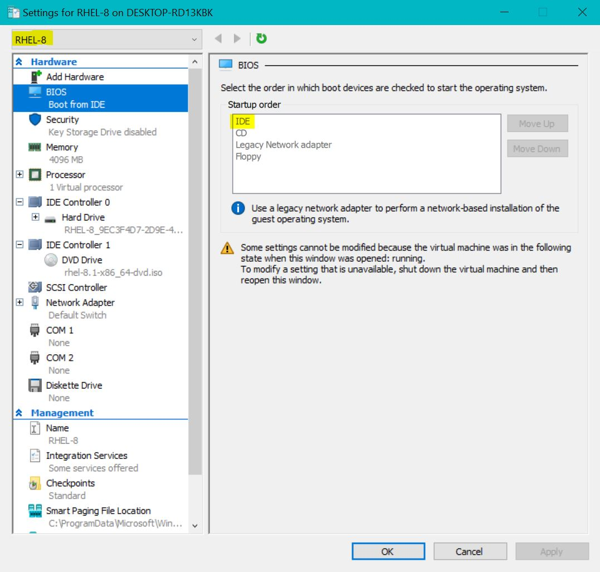
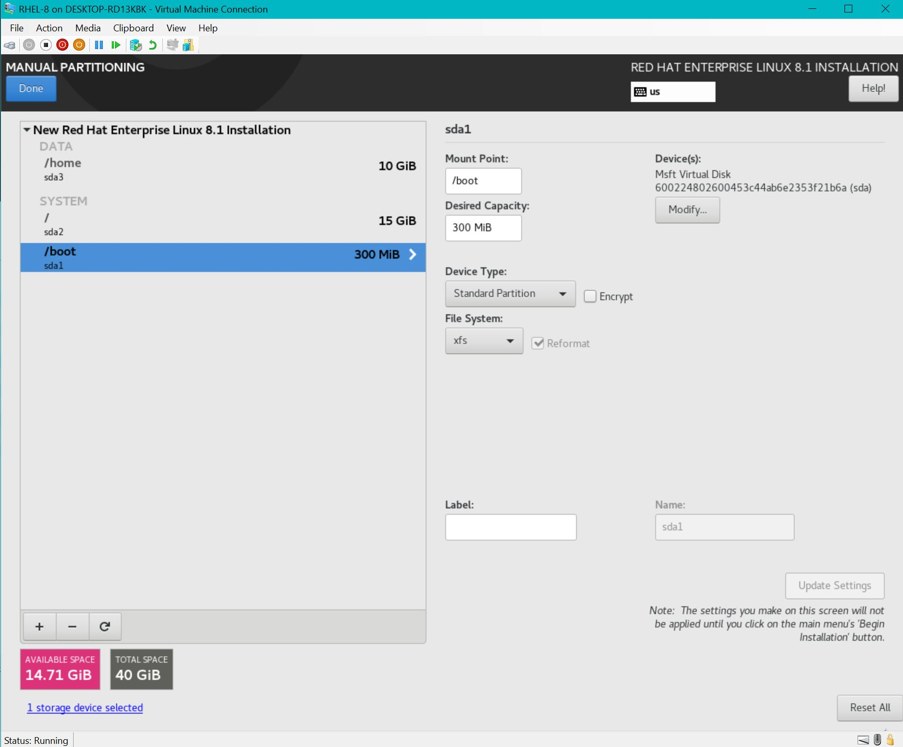
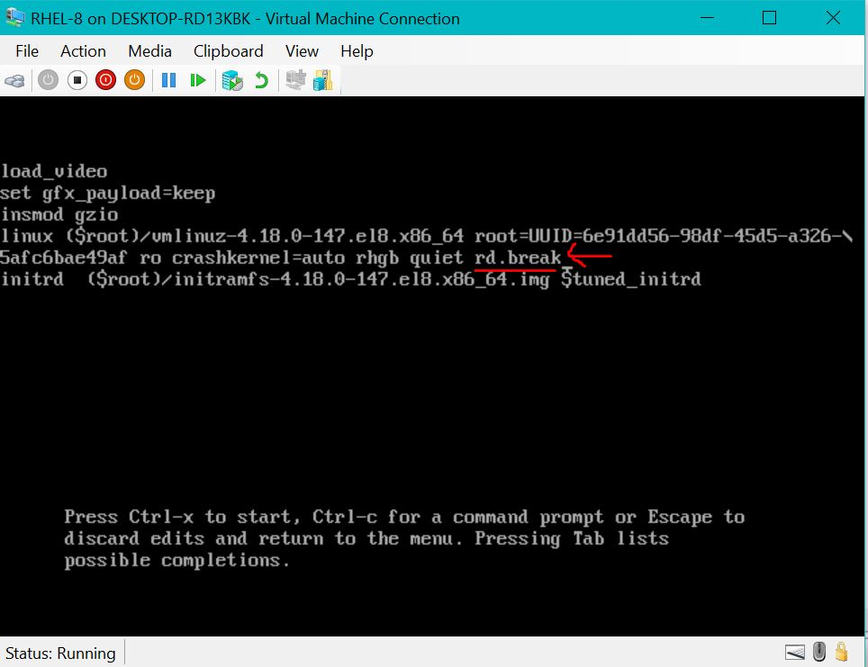
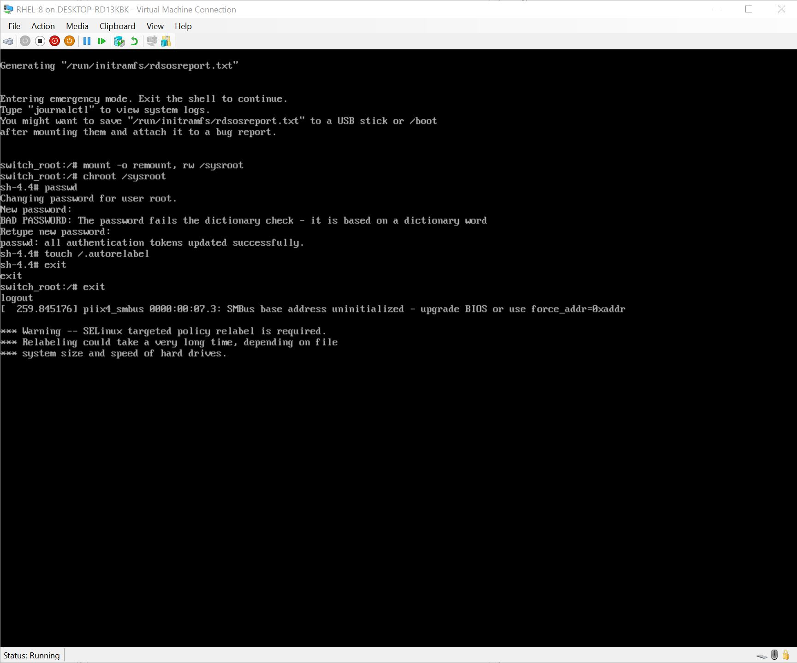
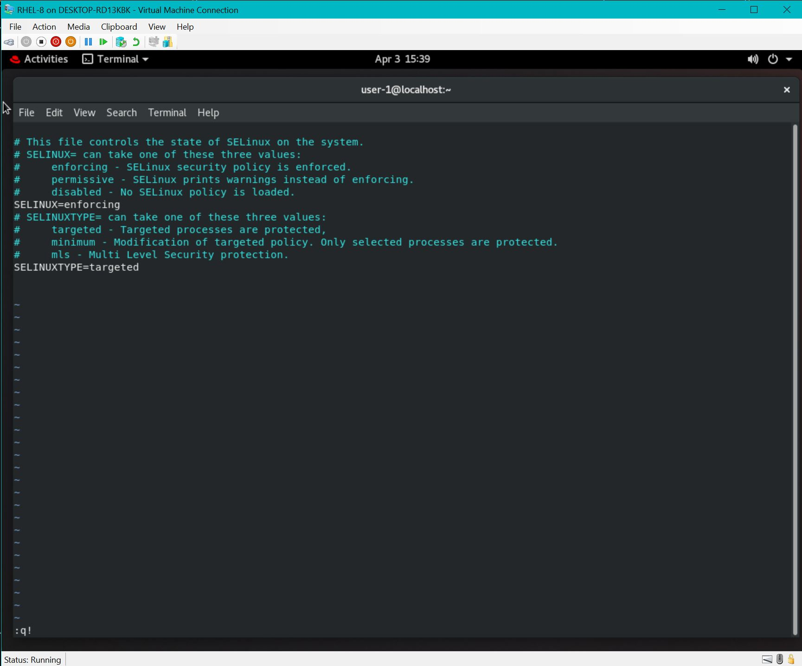

# Starting with Important Tasks

## Installing RHEL 8 VM on VMware Workstation (RHEL 8)

---

> **Task 1. Install RHEL 8 VM on VMware workstation using image file with disk space allocation as below**:
>> Total Disk Space (Max Disk Size) - 40 GiB\
"/" - 15 GiB\
"/home" - 10 GiB\
"/boot" - 300 MiB\
RAM Memory - 4GiB

Procedure (Building VM):
- Open VMware Workstation software & click on "Create a New Virtual Machine".
- Click "Next" & browse the OS Image File from your local storage.
- Give VM a name (i.e. "SYSTEM") & then click "Next".
- Give Max disk space = 40 GiB & click "Next".
- Customize hardware settings for Memory / RAM (4096 MB = 4GiB) & click "Finish".
- Before starting up the VM (this is a VMware specific step) go to "Edit virtual machine settings" delete the "SCSI" disk type and "Create a new virtual disk" select either "IDE" or "SATA" (use IDE & follow steps for disk space sizing).
- Also, before starting up the VM make sure the boot load order has "IDE" on top of "CD" or you'll encounter a loop-de-loop of the install. (see below image)

- Click on "Power on this virtual machine" - if you run into the below error:
> VMware Workstation and Device/Credential Guard are not compatible. VMware Workstation can be run after disabling Device/Credential Guard. Please visit http://www.vmware.com/go/turnoff_CG_DG for more details.

- run this command as Administrator: `bcdedit /set hypervisorlaunchtype off` & restart your host (`bcdedit /set hypervisorlaunchtype auto` to turn back on)

---

Procedure (RHEL 8 Installation set up): 
- Choose your preferred language for RHEL 8 installation
- Decide the installation destination for RHEL 8
     - Disk is already selected. Select "Custom" storage configuration to use manual partitioning.
     - Choose "Standard Partition" for the root file system ("/"), "/home", & "/boot".

- Now click on "Software Selection" and select "Workstation" (not "Server with GUI")
- & now click "Begin Installation" - we will configure Network settings later on...
- Provide root password and create a User (will take about 15-20 mins)
- Now reboot machine & accept the license agreement.

## Interrupt the boot process to set the root password (to gain access)

---

> **Task 2. Interrupt the boot process to set the root password as "password" (important for exam)**:

Procedure:
- Reboot the system. (in cli type `reboot`)
- Wait for GRUB menu to appear and then press "e" to edit.
- Find the line starting w/ "linux" & enter the "rd.break" at the end.
- Press CTRL + "x" to start / boot the system with these options. System enters in single-user mode.

- At this stage, root file system ("/") is mounted in read-only mode to /sysroot & must be remounted with r/w permissions
     - `mount -o remount, rw /sysroot` - to mount the root file system ("/")with r/w permissions
     - `chroot /sysroot` - switch /sysroot to "/" file system (executing `chroot` ON `/sysroot`)
     - `passwd` - to set the root password
     - (in the exam you will be given a password to set)
     - must trigger SELinux relabeling...
     - `touch /.autorelabel` - to relabel the SElinux contexts
     - `exit` - exit out of root file system ("/")
     - `exit` - exit out of /sysroot

## Set the SELinux to Enforcing mode

---

> **Task 3. Set the SELinux on system.example.com in enforcing mode**:

Commands:
- `getenforce` - to check the status of SELinux mode
- `vim /etc/selinux/config` - change the SELinux status from `=disabled` to `=enforcing` mode
- `:wq` or `:q` if no changes made (mine was already showing SELinux as `enforcing`)
- `systemctl reboot` - restart the system

## Verifying SELinux status

---

> **Task 4. Verifying SELinux status on system.example.com (in the exam, you must check to see that SELinux is in `enforcing` mode)**:

Commands:
- `sestatus` or `getenforce` - to check status of SELinux

 ######  * localhost login with server (w/o GUI) - username: `root`; pw: `admin` (or w/e pw you've set)

 ######  * need to "activate a connection" using `nmtui` and second selection. CLI way = `ifup eth0` & then `nmcli d` to check status 

**TODO**:
- [x] ~~understand `chroot` cmd~~
- [ ] rebuild VM and do not run `touch /.autorelabel` to see if SELinux is still in `enforcing` mode (my thoughts are that it will be `disabled`)
