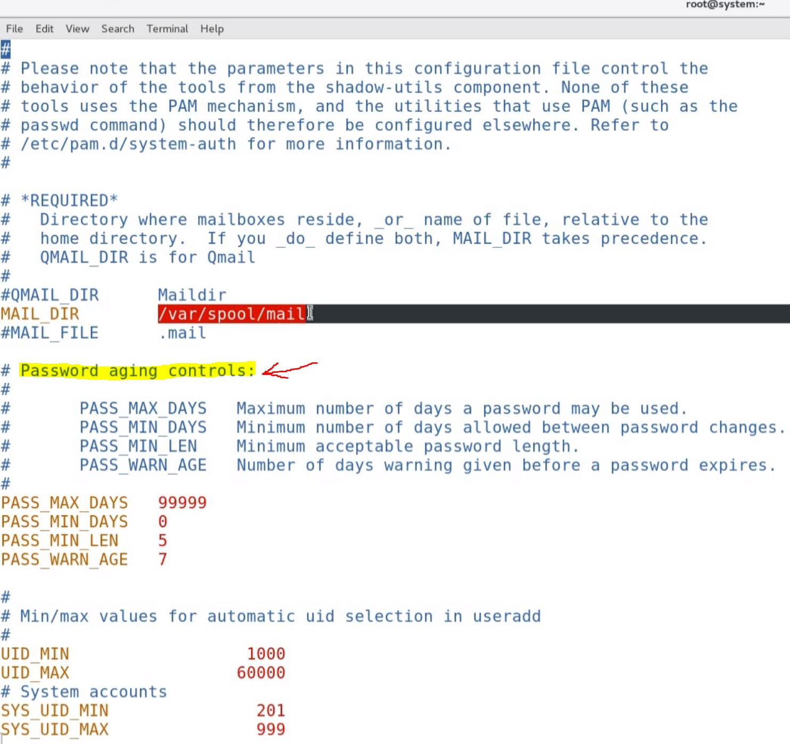
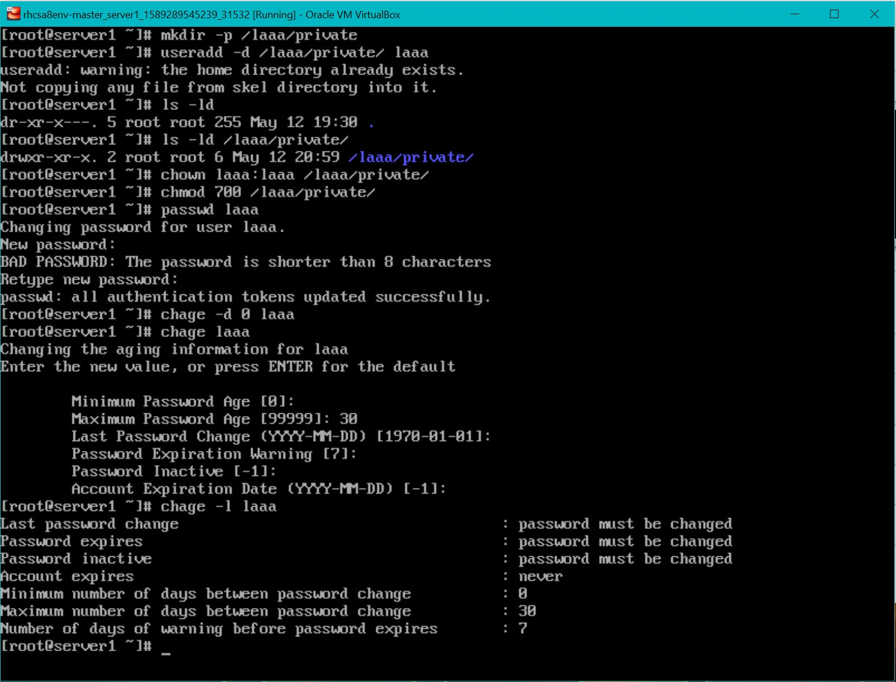
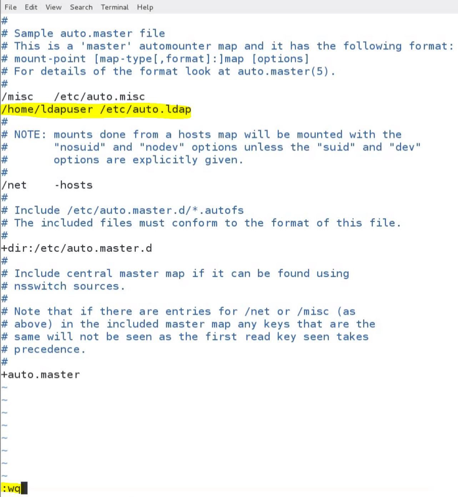

# Manage Users & Groups

## Introduction to Default User Settings

---

Commands (add a user & view default settings):
- `useradd test` - add default user "test" w/ default settings
- `cat /etc/default/useradd` - view default settings in `useradd` file which is located on `/etc/default/` :

```bash 
# useradd defaults file
GROUP=100 # group ID assigned to user is 100
HOME=/home # user home directory / PATH
INACTIVE=-1 # linked to user pw expiration (not used or disabled by default - if set to "5" user account will be disabled if pw expired past "5" days)
EXPIRE= # no value, so user account will never expire
SHELL=/bin/bash # default shell assigned to user
SKEL=/etc/skel # path for skeleton directory - normally sysadmin puts files here to set user env & these files are copied to user's home dir
CREATE_MAIL_SPOOL=yes #boolean - user mailbox will be created if set to "yes
```

The `login.defs` file which is present under `/etc/login.defs` provides the default config info for several user account parameters. ("Password Aging Controls" are important for exam)



## Verifying Different Settings of User Account

---

Commands (create password for user test):
- `passwd <insert login name>` - set password for user
- `id test` - see group & id (same b/c `USERGROUPS_ENAB yes`)
- `cat /etc/passwd` - contains one entry for each user
- `cat /etc/shadow` - check all password related info - one entry for each user (login name & then encrypted password & last time password was changed from Jan. 1, 1970 'til today and put that value here; then is the "inactive" field - empty if disabled; then "expire")
- `chage -l <insert login name>` - verify when user last changed their password and other settings info


## Override Default User Account Settings

---

Commands:
- `useradd --help` - view all the options for `useradd`
- `useradd -u <insert uid> <insert username>` - in the exam you may be asked to create a user with a specific user id or group id (ex: `useradd -u 1401 demouser1`)
- `passwd --help` - view different options for `passwd` (most important one being `-d` for delete)
- `chage --help` - view different options for `chage` - to avoid confusion prefer to use `chage` to apply settings for password aging control & account expiration settings; the rest w/ `useradd` cmd. For `passwd` probably only use to set the password & that's all.

## User creation w/ specific UID & non-interactive shell

---

> <span style="font-family:courier new">**Task 1. Create a user w/ name "lisa" w/ password "access"**:
>> - Use UID 434 for this user.
>> - User should have non-interactive shell.</span>

Commands:
- `useradd -u 434 -s /sbin/nologin lisa` - to create user w/ UID 434 & non-interactive login shell (`-s` is for specifying the shell & `/sbin/nologin` is for non-interactive shell - will not be allowed to login as user "lisa")
- `passwd lisa` - to set the passwrod for user "lisa"

Related files:
- `/etc/passwd` - contains the user account information (i.e. login name, home directory, UID, GID, Shell
- `/etc/shadow` - contains the encrypted password info & password aging & account expirations info
- `/etc/group` - contains the group related info

## User Creation w/ non-default Home & Password age control Settings

---

> <span style="font-family:courier new">**Task 2. Create a user "lara" w/ home directory `/lara/private` & set password "access"**:
>> - At first login, it should prompt to change the password
>> - Password should be set to expire after every one month</span>

Commands:
- `mkdir -p /lara/private` - to create the home directory for user (`-p` means parent - so it creates both the parent & the sub-directory)
- `useradd -d /lara/private lara` - to create user with non-default home directory `/lara/private` (will receive a warning regarding the home directory already exists & not copying any file from skel dir into it.)
- `ls -ld /lara/private` - user & group ownership is set to `root` but this should be set to the user itself.
- `chown lara:lara /lara/private` - to set User & Group Owner as lara (instead of `root` on this directory
- `chmod 700 /lara/private` - you can still see that Users & Groups still have access to this directory, but only lara should have access to it; run this cmd to restrict the access to lara for her home directory
- `passwd lara` - to set the password for user lara
- `chage lara` - to set the maximum password age & password change after first login
- `cat /etc/shadow` - verify max pw age & prompt for pw change upon login
- `chage -d 0 [username]` - force user to set password upon next login



Related files:
- `/etc/passwd` - contains the user account information (i.e. login name, home directory, UID, GID, Shell
- `/etc/shadow` - contains the encrypted password info & password aging & account expirations info
- `/etc/group` - contains the group related info

## Appending User to supplementary Group w/ specific GID

---

> <span style="font-family:courier new">**Task 3. Create a group named "sys" & assign this group to user "lara" as a secondary group**:
>> - GID 555 should be used.</span>

Commands:
- `groupadd --help` - view particular groupadd options
- `groupadd -g 555 sys` - to create group sys with GID 555 (`-g` = use GID for the new group)
- `usermod --help` - (`-a` = append & `-G` = new list of supplementary GROUPS)
- `usermod -aG sys lara` - to assign `sys` group to user `lara` as supplementary group
- `id lara` - shows primary & secondary groups for lara

Related files:
- `/etc/group` - contains the group related info

## Creation of User w/ non-default Password aging settings

---

> <span style="font-family:courier new">**Task 4. Create user "harry" & set password as "access"**:
>> - Account should expire on 31st Dec 2020.
>> - Password should expire every 7 days.
>> - Set password expiry warning to 2 days.</span>

Commands:
- `useradd harry` - to create user harry w/ default settings
- `passwd harry` - to set the password for harry
- `chage harry` - to set the max password age, password expiry warning & account expiration date
- `chage -l harry` - to verify changes

Related files:
- `/etc/passwd` - contains the user account information (i.e. login name, home directory, UID, GID, Shell
- `/etc/shadow` - contains the encrypted password info & password aging & account expirations info
- `/etc/group` - contains the group related info

## Setting User Owner & Group Owner for Directory

---

> <span style="font-family:courier new">**Task 5. Create the directory `/group` & set the group & user ownership to "sys" & "lisa" respectively**:
>> - Give read-only access to group "sys" & 'rwx' access to "lisa" (**read-only access must have execute rights also**)</span>

Commands:
- `mkdir /group` - to create the directory `/group`
- `chown lisa:sys /group` - to set lisa as user owner & sys as group owner
- `ls -ld /group` - verify ownership

## Automount Home Directory of LDAP User w/ `autofs`

---

> <span style="font-family:courier new">**Task .6 Configure "server1" to automount home directory of LDAP user "ldap" when logged in**:
>> - Home directory of LDAP user is `/home/ldapuser/ldap`.
>> - Home directory is shared by "server2" through NFS export.
>> - LDAP user should get his home directory when logged in.</span>

Commands:
- `yum install autofs` - to install packages required `autofs`
- `systemctl start autofs` - to start the service
- `systemctl enable autofs` - to enable the service to start automatically on boot
- `vi /etc/auto.master` - define the base location for the home directory in `auto.master` file which is used by `autofs`
> `/home/ldapuser` `/etc/auto.ldap` (underneath /misc etc.)
- `:wq`
- `man showmount` - (we will use the `-e` for exports which shows the NFS server's export list) - **had to `yum install nfs-utils` for `showmount` cmds**
- `showmount -e server2:` (hostname for NFS server, if you don't have DNS configured the hostname can be resolved into IP, so you could use IP here - in the exam you will get everything configured on DNS)
- `vi /etc/auto.ldap` - here we will define the home directory (which is ldap)
> `ldap` `server2:/home/ldapuser/ldap` (first line)
- `:wq` 
- `systemctl restart autofs` - restart the `autofs` service to make all the configs effective
- `su - ldap` - switch to user ldap
- `pwd` - ldap home directory should be shown (`/home/ldapuser/ldap`)



## Automount for Home Directories of multiple LDAP Users using wild cards

---

> <span style="font-family:courier new">**Task 7. Configure "server1" to automount home directory of LDAP users "ldap1" & "ldap2"**:
>> - Home directory of LDAP users ldap1 & ldap2 is `/home/ldap1` & `/homeldap2` respectively.
>> - Home directory is shared by "server2" through NFS export.
>> - LDAP user should get his home directory when logged in.
</span>

Commands:
- `yum install autofs` - to install packages required `autofs`
- `systemctl start autofs` - to start the service
- `systemctl enable autofs` - to enable the service to start automatically on boot
- `vi /etc/auto.master` - define the base location for the home directory in `auto.master` file which is used by `autofs`
> `/home` `/etc/auto.ldap12` (underneath previous one added)
- `:wq`
- `man showmount` - (we will use the `-e` for exports which shows the NFS server's export list)
- `showmount -e server2:` (hostname for NFS server, if you don't have DNS configured the hostname can be resolved into IP, so you could use IP here - in the exam you will get everything configured on DNS)
- `vi /etc/auto.ldap12` - here we will define the home directory (which is ldap12)
> `*` `server2:/home/&` (first line) (`*` wildcard represents home directories for both users & then the complete path - since we're configuring for both users we use `&` as a wildcard as well)
- `:wq` 
- `systemctl restart autofs` - restart the `autofs` service to make all the configs effective
- `su - ldap1` - switch to user ldap
- `pwd` - ldap home directory should be shown (`/home/ldapuser/ldap`)

## Deletion of User & associated data

---

> <span style="font-family:courier new">**Task 8. Delete existing user "maria" from `server1`**:
>> - User home directory & mailbox should also be deleted.</span>

Commands:
- `id maria` - check to see if user maria exists
- `userdel --help` - to see the limited options (mainly `-r` to remove user and everything else)
- `userdel -r maria` - to delete user & also home direcotry & mail spool.

## Configure User to use root privileges w/ `sudo`

---

> <span style="font-family:courier new">**Task 9. Modify user harry account so that harry should be able to use root permissions w/ `sudo`**:
>> - Create a test user w/ username TEST as harry user.</span>

Commands:
- `vi /etc/group` - find the wheel group (empower's a user to execute otherwise restricted cmds) & add user harry to this group
> `wheel:x:10:harry`
- `:wq`
- `su - harry` - switch to user harry
- `sudo useradd TEST` - add user TEST as user harry w/ sudo & enter harry's pw ("access") it should be created - can verify with `id TEST`

**TODO**:
- [ ] revisit automount home directory w/ autofs (Task 6. & 7.)
- [ ] review `useradd` options to familiarize with different useradd options when creating user.
