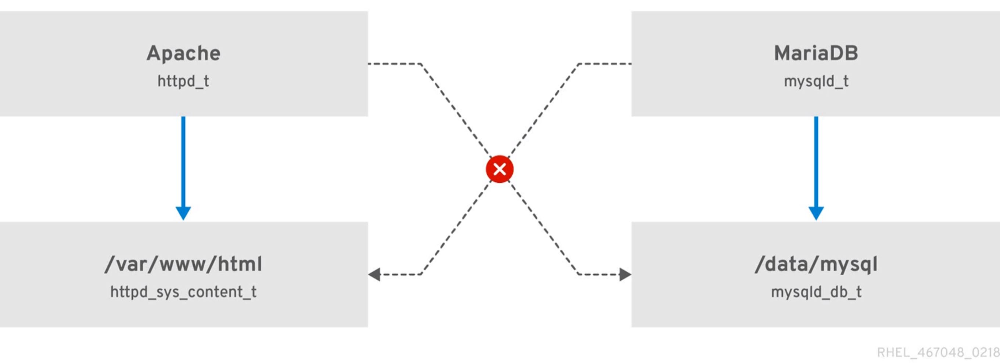
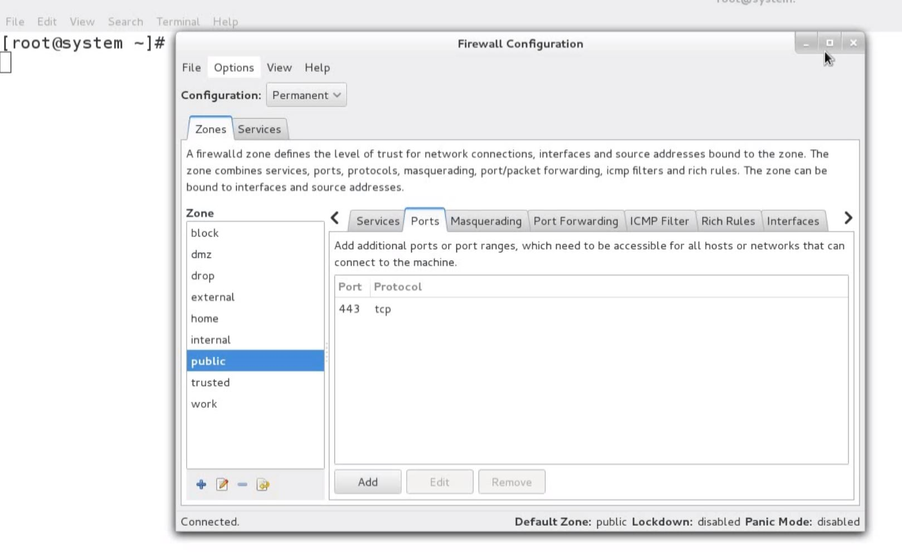

# Managing Security

## Brief Introduction to SELinux (Security Enhanced Linux)

---

- SELinux implements Mandatory Access Control (MAC). Every process & system resource has a special security label called SELinux context.

- The SELinux policy uses these contexts in a series of rules which define how processes can interact with each other and the various system resources. By default, the policy does not allow any interaction unless a rule explicitly grants access.

- SELinux contexts have several fields: **user**, **role**, **type**, and **security level**. The SELinux type information is the most important when it comes to the SELinux policy, as the most common policy rule which defines the allowed interactions between processes and system resources uses SELinux types and not the full SELinux context.
    - For example, the SELinux type name for the web server process is **httpd_t**.
    - The type context for files & directories normally found in `/var/www/html/` is **httpd_sys_content_t**.

Commands:
- `ps -eZ` - to list SELinux context for Processes
- `ls -ldZ` - to list SELinux context for Directories

## Setting SELinux Context Type persistently

---

> **Task 1. Web server (httpd) needs to access the files in `/web` directory. Set the correct SELinux context type on `/web` directory to make this possible**:
>> - Restore the SELinux context.
>> - Changes done should be persistent.

Commands:
- `yum install httpd` - install web service package
- `systemctl start httpd` - start & enable the web service
- `systemctl enable httpd` - start & enable the web service
- `ps -eZ | grep httpd` - check SELinux context type on the process
- `ls -ldZ /var/www/html` - check SELinux context type on /var/www/html directory
- `mkdir /web` - make `/web` directory
- `ls -ldZ /web` - list contexts on this directory (`default_t`) but need to change to (`httpd_sys_content_t`)
- ~`chcon -t httpd_sys_content_t /web` - to set the SELinux Context type for _run time_, not permanent (`chcon` = change context option; `-t` = set the security context type)~
- `semanage fcontext -a -t httpd_sys_content_t "/web(/.*)?"` - to set the SELinux Context type _persistently_ (can view `man semanage fcontext` ) - this command is found in the man page: to add file-contest for everything under "/web" --- (had to run a couple of commands as I ran into "__-bash: semanage: command not found__" error - `yum provides /usr/sbin/semanage` & `yum install policycoreutils-python-utils`)
- `restorecon -Rv /web` - to restore the SELinux Context
- `ls -ldZ /web` - to verify the SELinux Context

## Configuring firewall using firewall-cmd

---

> **Task 2. Configure the firewall on "server1" to allow inbound "http" traffic**:
>> - Change done should be persistent.

Commands:
- `systemctl status firewalld` - to check the status of firewalld service
- `firewall-cmd --get-services` - to get list of firewalld services
- `firewall-cmd --add-service=http` - to add service on firewall to allow inbound traffic for runtime environment
- `firewall-cmd --add-service=http --permanent` - to add service on firewall persistently to allow inbound traffic (must reload firewall to make effective immediately - `firewall-cmd --reload`)
- `firewall-cmd --list-all` - to display all firewall settings

## Configuring firewall using firewall-config (Graphical Interface)

---

> **Task 3. Configure the firewall to accept inbound traffic on 443/tcp port**:
>> - Changes done should be persistent.
>> - Use firewall-config for this task.

Commands:
- `systemctl status firewalld` - to check the status of `firewalld` service
- `firewall-config` - to use GUI for firewall settings
- `configuration` - `permanent`
- `public`
- go to `Ports` tab
- `Add` `443` `tcp` click "ok"
-`options` - `reload` firewall
- `firewall-cmd --list-all` - to display all firewall settings

**TODO**:
- [x]  ~run through these on server1~
